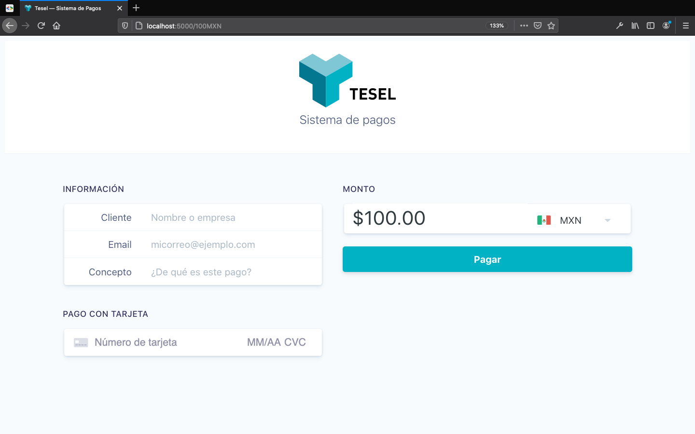

Pagos Tesel utilizando la plataforma Stripe
===========================================

Este repositorio es un ejemplo de pagos _eventuales_ usando [Stripe](https://stripe.com/). Esto significa que lo puedes ocupar para tomar un pago via Stripe sin necesidad de tener un producto registrado en la plataforma.



Mediante `vue-router` soporta cuatro diferentes URL paths, para `MXN` y `USD` por ejemplo:

- http://localhost:5000/mxn/1000 abre el formulario de pago con `MXN` como moneda y el monto en $1,000
- http://localhost:5000/usd/1000 abre el formulario de pago con `USD` como moneda y el monto en $1,000
- http://localhost:500/1000mxn abre el formulario de pago con `MXN` como moneda y el monto en $1,000
- http://localhost:5000 abre el formulario en blanco

Todos estos URL paths funcionan sin importar las mayúsculas o minúsculas.

El proyecto utiliza Stripe Elements, Vue y Firebase Cloud Functions.


El proyecto esta diseñado para tener requerimientos mínimos. Utiliza Firebase Cloud Functions como backend, lo cual requiere de un entorno de Node. Mientras que todas las dependencias de la interfaz web se adquieren via CDN.

## Interfaz Web

Todas las dependencias se adquieren vía CDN:

- [Bootstrap](https://getbootstrap.com/)
- [Google Fonts](https://fonts.google.com/)
- [Stripe Javscript SDK](https://github.com/stripe/stripe-js)
- [Vue](https://vuejs.org/) and [Vue router](https://router.vuejs.org/)
- [Vue Currency Input](https://github.com/dm4t2/vue-currency-input)
- [axios](https://github.com/axios/axios)

### Estructura

La interfaz comprende los siguientes archivos:

- `public/index.html`
- `public/style.css`
- `public/app.js`
- `public/images/`

En `public/index.html`

Los estilos se definen principalmente en `public/style.css` pero se usa el sistema de grid de Bootstrap.

Toda la lógica del frontend se encuentra en `public/app.js` y esta escrita utilizando Vue.js exclusivamente.

### Configuración

La configuración del proyecto se puede realizar en el objeto `config` de `public/app.js`.

```javascript
const config = {
  stripe: {
    pk: "",
    endpoint: "",
    currencies: [
      "usd",
      "mxn"
    ]
  }
}
```

- `pk`: La **Publishable Key** de Stripe. Puedes conseguirla en el [dashboard](https://dashboard.stripe.com/apikeys) de Stripe.
- `endpoint`: La URL de la Firebase Cloud Function. Que puedes encontrar en la [consola](https://console.firebase.google.com/) de Firebase
- `currencies`: Este es un arreglo de currencies en formato ISO que el sistema soporta.

En este momento no hay _safeguards_ para las monedas, de modo que debes asegurarte de que las monedas del arreglo `currencies` son soportada por Stripe.

Por el momento las banderas que soportamos son exclusivamente las banderas de México y Estados Unidos, pero en siguientes versiones agregaremos más.

---

Los colores y logotipos, incluido el favicon, deberás cambiarlos manualmente ya sea en `public/style.css` o `public/index.html`.

## Firebase Cloud Functions+

_Para poder utilizar Firebase Functions es necesario instalar Firebase cli. Puedes encontrar más información sobre cómo instalarlo [aquí](https://firebase.google.com/docs/cli)_

Una vez que se instala Firbase CLI puedes instalar el resto de las dependencias con

```bash
npm install
cd functions
npm install
```

Las única Cloud Function necesaria se encuentra en `functions/src/index.ts` utiliza Express para registrar la función y poder utilizar CORS pero el código realmente es la función `handler`

Necesitarás definir una variable de entorno con tu **Stripe Secret Key** con el comando

```bash
firebase functions:config:set stripe.secret="THE API KEY"
```

Esta llave la puedes obtener en el [dashboard](https://dashboard.stripe.com/apikeys) de Stripe


# Contribuyendo

El proyecto esta liberado bajo la licencia MIT. Si quieres hacer un pull request puedes hacerlo así como levantar Issues en el issue tracker de GitHub. Si el proyecto llegara a crecer, es posible que se implementen guidelines más estrictos de contribución.
